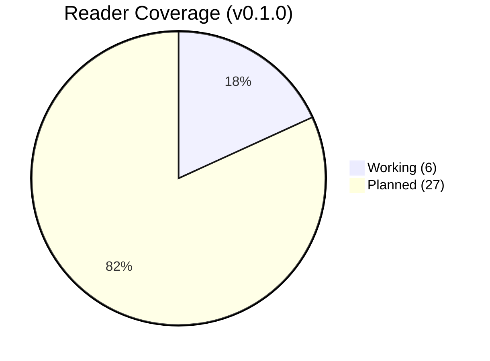
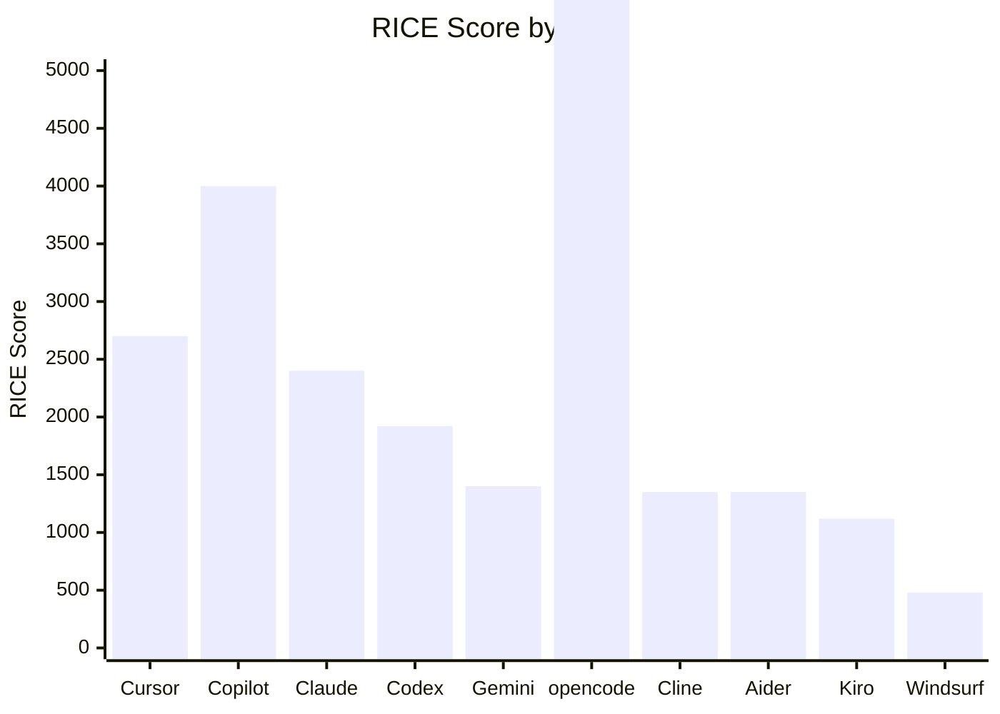

# AgentSON

**Preserve the operational life of an AI agent, independently of the runtime that hosted it.**

[](https://pypi.org/project/agentson/)
[](LICENSE)
[](https://pypi.org/project/agentson/)
[](https://github.com/andiekobbietks/AgentSON/actions)

> Nobody has done for agent session logs what OpenAPI did for REST APIs or what containers.dev did for dev environments.

---

## Why This Exists

This project started with a FreeStyle Libre 2 continuous glucose monitor.

Managing a chronic condition means your most personal data — blood glucose readings every 5 minutes, 24/7 — lives inside a vendor's app. Abbott's FreeStyle Libre app stores your data. It doesn't export to JSON. It doesn't integrate with your AI tools. It doesn't connect to your doctor's system without jumping through NHS FHIR hoops.

The same lock-in problem exists everywhere:

| Domain | Vendor | Data trapped |
|--------|--------|--------------|
| Health | Abbott (FreeStyle Libre 2) | Glucose readings, trends, reports |
| AI coding | OpenAI, Anthropic, Google | Session transcripts, reasoning traces |
| Development | Cursor, Copilot, Claude Code | Code context, edit history |

**GDPR Article 20** gives you the right to export your data in a machine-readable format. **The EU AI Act** requires transparency about AI-generated content. Most tools don't provide this. AgentSON does.

The FreeStyle Libre reader (`readers/libre.py`) was the first reader built — not because glucose data is the most important, but because it's the most personal. If the format can handle medical time-series data, it can handle anything.

> **Your health data. Your code sessions. Your data. One format.**

---

## The Problem

Every AI coding agent stores session data in its own proprietary database. There is no standard format, no export API, and no way to move context between tools. The data that powers AI training is locked inside vendor silos.

## The Solution

AgentSON captures the full trajectory of what happened during an AI-assisted session: prompts, thoughts, actions, code, observations, and outcomes — in one portable JSON file.

```
┌───────────────────────────────────────────────────────────────────┐
│                  Agent Runtime Layer (producers)                   │
├───────────────────────────────────────────────────────────────────┤
│  ┌─────────┐ ┌──────────┐ ┌──────────┐ ┌──────────┐ ┌─────────┐ │
│  │ OpenClaw│ │ClaudeCode│ │  Cursor  │ │ opencode │ │LangGraph│ │
│  └────┬────┘ └────┬─────┘ └────┬─────┘ └────┬─────┘ └────┬────┘ │
│  ┌────┴────┐ ┌────┴─────┐ ┌────┴─────┐ ┌────┴─────┐ ┌────┴────┐ │
│  │ CrewAI  │ │ AutoGen  │ │ OpenAI   │ │  Gemini  │ │  Cline  │ │
│  │         │ │          │ │ Agents   │ │   CLI    │ │  Aider  │ │
│  └────┬────┘ └────┬─────┘ └────┬─────┘ └────┬─────┘ └────┬────┘ │
│       │           │            │           │             │       │
│       ▼           ▼            ▼           ▼             ▼       │
│  ┌─────────────────────────────────────────────────────────────┐ │
│  │                   .AgentSON Files (Open Spec)               │ │
│  │               Portable, vendor-neutral, file-based          │ │
│  └───────────────────────────┬─────────────────────────────────┘ │
│                              │                                    │
│               ┌──────────────┼──────────────┐                   │
│               ▼              ▼              ▼                   │
│  ┌─────────────────┐ ┌──────────────┐ ┌──────────────────┐    │
│  │   Local CLI     │ │   Supabase   │ │  Web Viewer      │    │
│  │  (search/replay)│ │  (optional)  │ │  (shared replay) │    │
│  └─────────────────┘ └──────────────┘ └──────────────────┘    │
│                                                                   │
└───────────────────────────────────────────────────────────────────┘
```

---

## Tool Landscape

AgentSON covers the entire AI coding ecosystem — 33 tools across 7 tiers.

### Reader Coverage



### RICE Priority (Top 10 Readers)



> opencode (RICE: ∞) already works — zero effort, full reach.

### Tier 1: Core Market

| # | Tool | Type | Pricing | Traces | AgentSON |
|---|------|------|---------|--------|----------|
| 1 | **Cursor** | IDE | $20-40/mo | Richest (70% Fortune 1000) | 🔜 Planned |
| 2 | **Claude Code** | CLI | $20-200/mo | Deep reasoning (~$2.5B run-rate) | ✅ **Working** |
| 3 | **Kiro** | IDE | Free-$200/mo | Spec-driven (structured by design) | 🔜 Planned |
| 4 | **Codex CLI** | CLI | $20-200/mo | GPT-5.5 (ChatGPT base) | 🔜 Planned |
| 5 | **Gemini CLI** | CLI | Free | 1M context (Apache 2.0) | 🔜 Planned |
| 6 | **Windsurf/Devin Desktop** | IDE | $15-200/mo | ACP protocol (Cognition) | 🔜 Planned |

### Tier 2: Open Source

| # | Tool | Type | Pricing | Traces | AgentSON |
|---|------|------|---------|--------|----------|
| 7 | **opencode** | CLI | Free (BYOK) | 147K stars, 6.5M devs | ✅ **Working** |
| 8 | **Cline** | VS Code ext | Free (BYOK) | 60K stars, 5M installs | 🔜 Planned |
| 9 | **Aider** | CLI | Free (BYOK) | 43K stars, MIT | 🔜 Planned |
| 10 | **Zed** | IDE | Free + API | ACP protocol, parallel agents | 🔜 Planned |
| 11 | **Goose** | CLI | Free (BYOK) | Apache 2.0, Block-backed | 🔜 Planned |
| 12 | **OpenHands** | Web+CLI | Free (BYOK) | MIT, autonomous SWE | 🔜 Planned |

### Tier 3: Extensions

| # | Tool | Type | Pricing | Traces | AgentSON |
|---|------|------|---------|--------|----------|
| 13 | **GitHub Copilot** | Multi-IDE | $10-39/mo | Widest reach (5M+ users) | 🔜 Planned |
| 14 | **Amazon Q** | Extension | $19/user | AWS-native, enterprise | 🔜 Planned |
| 15 | **JetBrains AI** | Built-in | $10/mo | 31% market share | 🔜 Planned |
| 16 | **Sourcegraph Cody** | Extension | Free-$9/mo | Large codebase nav | 🔜 Planned |
| 17 | **Qodo** | Extension | Free-$19/mo | Code review specialist | 🔜 Planned |
| 18 | **Augment Code** | Extension | $20-60/mo | 200K context window | 🔜 Planned |
| 19 | **Continue** | Extension | Free | Open-source, self-hosted | 🔜 Planned |
| 20 | **Tabnine** | Extension | $12/mo | Privacy-focused, on-premise | 🔜 Planned |

### Tier 4: Builders

| # | Tool | Type | Pricing | Traces | AgentSON |
|---|------|------|---------|--------|----------|
| 21 | **Bolt.new** | Browser | Free-$20/mo | Prompt→deploy | 🔜 Planned |
| 22 | **v0** | Browser | Free-$20/mo | UI generation | 🔜 Planned |
| 23 | **Lovable** | Browser | Free-$20/mo | Full-stack apps | 🔜 Planned |
| 24 | **Replit** | Browser IDE | Free-$25/mo | Full environment | 🔜 Planned |

### Tier 5: Orchestrators

| # | Tool | Type | Pricing | Traces | AgentSON |
|---|------|------|---------|--------|----------|
| 25 | **amux** | Web+PWA | Free (BYOK) | 20-50+ parallel agents | 🔜 Planned |
| 26 | **Claude Squad** | TUI | Free (BYOK) | MIT, 10-20 agents | 🔜 Planned |
| 27 | **Kilo Code** | IDE panel | Free-$199/mo | Apache 2.0 | 🔜 Planned |
| 28 | **dmux** | Terminal | Free (BYOK) | MIT | 🔜 Planned |

### Tier 6: Autonomous

| # | Tool | Type | Pricing | Traces | AgentSON |
|---|------|------|---------|--------|----------|
| 29 | **Devin** | Cloud SaaS | $20-500+/mo | Fully autonomous | 🔜 Planned |
| 30 | **Blitzy** | Cloud SaaS | Enterprise | Enterprise SWE | 🔜 Planned |

### Tier 7: China Plans

| # | Tool | Type | Pricing | Traces | AgentSON |
|---|------|------|---------|--------|----------|
| 31 | **GLM Coding** | Desktop+CLI | Subscription | GLM-5.2 | ⏸ Deferred |
| 32 | **Kimi** | CLI | Cheap | Cost leader | ⏸ Deferred |
| 33 | **Qwen Code** | CLI | Cheap | Growing in Asia | ⏸ Deferred |

---

## Why AgentSON Matters

### The Unsloth Analogy

Unsloth democratized model fine-tuning. AgentSON democratizes data ownership.

| Before | After |
|--------|-------|
| GPU cluster + PhD needed | Single GPU, hours |
| No export API, vendor lock-in | One CLI command, portable JSON |
| Big labs only | Everyone |

### But It's Locked In

| Tool | Exports data? | Portable? | Trainable? |
|------|--------------|-----------|------------|
| Cursor | No | No | No |
| Claude Code | No | No | No |
| Copilot | Partial (API) | No | No |
| **AgentSON** | **Yes (JSON)** | **Yes** | **Yes** |

### For Developers

Your AI work across every runtime — OpenClaw, Claude Code, Cursor, opencode, Aider, Cline, Gemini CLI — becomes one searchable, portable, analysable record. Switch runtimes without losing your operational history. Every `.AgentSON` file is a personal engineering journal that follows you.

- **Portability** — Switch tools without losing context
- **Search** — Full-text search across all your sessions
- **Replay** — Re-run or review any agent session offline
- **Ownership** — No telemetry, no vendor lock-in, no cloud dependency

### For the Organisation

As AI agents become long-lived team members (Claude Tag, persistent agents), organisations will need to answer: what did this agent do over the last six months? Why did it make this decision? Can we migrate it to another platform? Can we audit its behaviour? Can we learn from its successful workflows?

Memory systems (MCP, bespoke databases) don't give you portable answers to those questions. AgentSON does.

- **Institutional knowledge** — Preserve the operational life of every agent independently of where it ran
- **Vendor independence** — Change runtimes, keep the record
- **Compliance** — GDPR Art. 20 + EU AI Act Art. 52
- **Training-data export** — Export to Unsloth/Olive for fine-tuning

---

## Quick Start

```bash
# Install
pip install agentson

# List sessions
agentson list --tool opencode

# Export a session
agentson export --tool opencode --session ses_xxx --output ./sessions/

# Fine-tuning export (Unsloth format)
agentson finetune *.AgentSON --format unsloth --output training.jsonl

# Search across sessions
agentson search "nightscout" --tool opencode

# Render as Markdown
agentson render session.AgentSON --format md

# Push to Supabase (optional)
agentson push session.AgentSON
```

---

## Schema (v1.1)

```json
{
  "$schema": "https://agentson.dev/schema/v1.1.json",
  "id": "session-2026-07-04-001",
  "task": "Fix the authentication bug in the login flow",
  "outcome": "success",
  "tool": {"name": "opencode", "session_id": "ses_xxx"},
  "agent": {"name": "mimo-v2.5-free", "provider": "opencode"},
  "entries": [
    {"type": "user-query", "text": "Fix the auth bug"},
    {"type": "thought", "text": "Looking at the auth module..."},
    {"type": "action", "tool": "bash", "code": "grep -r 'auth' src/", "tool_call_id": "tc_001"},
    {"type": "observation", "text": "Found 3 files", "correlation_id": "tc_001"},
    {"type": "answer", "text": "Fixed the null check in auth.py"}
  ]
}
```

### Entry Types

| Type | Description |
|------|-------------|
| `user-query` | User's input or question |
| `context` | Additional context (data used, DOM info) |
| `querying` | Agent is processing |
| `title` | Section or step title |
| `thought` | Agent's reasoning/thinking |
| `action` | Tool execution (code + output) |
| `answer` | Agent's response |
| `side-effect` | File changes, state mutations |
| `observation` | Async observation from tool/user/system |

---

## Fine-Tuning Export

```bash
# Unsloth/ShareGPT format (for LLaMA, Mistral, etc.)
agentson finetune *.AgentSON --format unsloth --output train.jsonl

# Olive format (Microsoft Olive pipeline)
agentson finetune *.AgentSON --format olive --output train.jsonl
```

Example output:
```json
{
  "conversations": [
    {"from": "human", "value": "How do I fix the auth bug?"},
    {"from": "gpt", "value": "I'll look at the auth module..."}
  ],
  "source": "opencode",
  "session_id": "ses_xxx"
}
```

---

## PWA Viewer

Open `pwa/index.html` in a browser, drag-and-drop an `.AgentSON` file. Works offline.

Full-featured web viewer at `docs/viewer/`: validation, download, search, sort, side-by-side layout, role-based colors.

---

## Repository Structure

```
agentson/
├── spec/
│   ├── v1.json              # JSON Schema v1
│   └── v1.1.json            # JSON Schema v1.1 (trajectory semantics)
├── readers/                 # Tool-specific readers
│   ├── opencode.py          # ✅ Working
│   ├── minimax.py           # ✅ Working
│   ├── antigravity.py       # ✅ Working
│   ├── libre.py             # ✅ Working (FreeStyle Libre 2)
│   ├── chrome_devtools.py   # ✅ Working (9 tests)
│   └── claude_code.py       # ✅ Working
├── importers/
│   └── chatgpt.py           # ✅ ChatGPT conversations.json
├── exporters/
│   └── finetune.py          # ✅ Unsloth + Olive formats
├── cli/
│   ├── main.py              # CLI entry point
│   └── supabase_client.py   # Supabase integration
├── tests/
│   └── test_chrome_devtools.py  # ✅ 9 tests
├── examples/                # Example .AgentSON files
├── pwa/                     # PWA viewer
├── docs/                    # Live docs + viewer
│   ├── viewer/              # Web viewer
│   ├── sops/                # 14 SOPs
│   ├── standards/           # Operating manual + ADRs
│   └── index.html           # Landing page
├── ROADMAP.md               # RICE-scored reader priorities
├── CHANGELOG.md             # Version history
├── PRD.md                   # Product requirements
└── LICENSE                  # Apache 2.0
```

---

## Roadmap

See [ROADMAP.md](ROADMAP.md) for the full RICE-scored roadmap across all 33 tools.

**Next readers:** OpenClaw, Cursor, Cline, Aider, Gemini CLI, Copilot

**Version targets:**
- v0.2.0 (Aug 2026): 10+ readers, real-world data
- v0.3.0 (Sep 2026): 15+ readers, sample corpus
- v1.0.0 (Oct 2026): 20+ readers, stable API

---

## Standards

- [Operating Manual](https://andiekobbietks.github.io/AgentSON/standards/) — Mental models, coding standards, workflow rules
- [ADRs](https://andiekobbietks.github.io/AgentSON/standards/) — Architecture Decision Records (11 ADRs)
- [SOPs](https://andiekobbietks.github.io/AgentSON/sops/) — 14 Standard Operating Procedures

---

## License

[Apache 2.0](LICENSE) — Patent grant + attribution required.

---

*"The operational life of an AI agent, preserved independently of the runtime that hosted it."*
